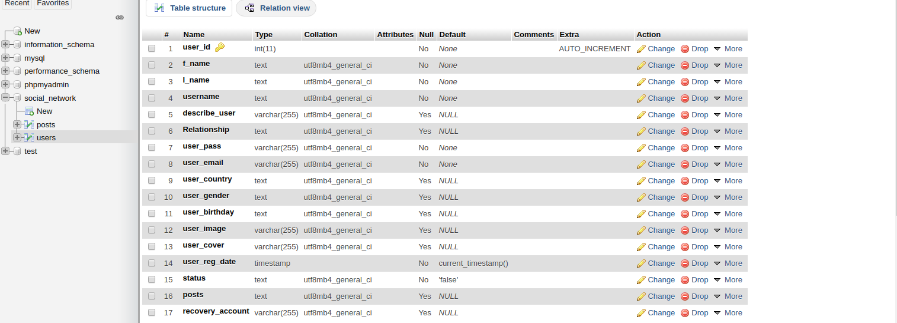
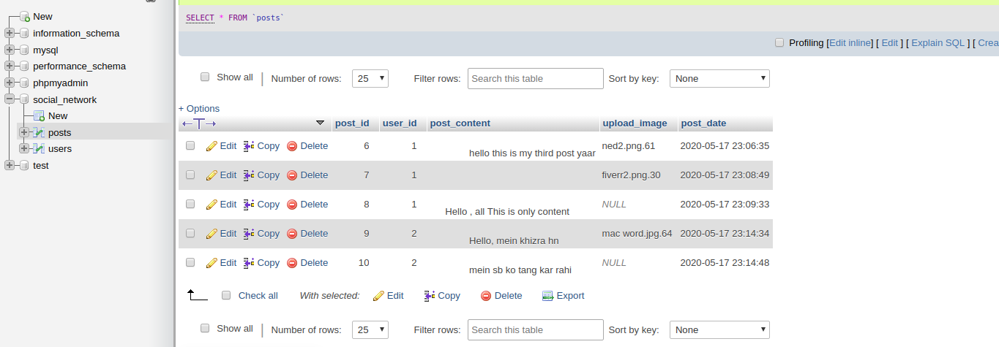

# Database Name : social_network

## Table: users
___
Fields:
1. user_id--------------------------Int(11)------------------A.I= please check this column while making table
2. f_name ------------------------ text  
3. l_name -------------------------text  
4. username ---------------------text
5. describe_user ---------------varchar(255)-----------Default : Null
6. Relationship ------------------text-----------------------Default : Null
7. user_pass ---------------------varchar(255)
8. user_email --------------------varchar(255)
9. user_country------------------text ---------------------Default : Null
10. user_gender ------------------text ---------------------Default : Null
11. user_birthday -----------------text ---------------------Default : Null
12. user_image -------------------varchar(255)----------Default : Null
13. user_cover---------------------varchar(255)----------Default : null
14. user_reg_date----------------TimeStamp------------Default(Current Timestamp)
15. status----------------------------text----------------------Default : false
16. posts-----------------------------text----------------------Default : Null
17. recovery_account------------varchar(255)-----------Default : Null

## Table Name : posts

Fields :

Name  -----------------Type

1- post_id------------Int(11)----------------------Primary Key
2- user_id -----------Int(11)
3- post-content------Varchar(255)
4- upload_image----Varchar(255)------------Default : Null
5- post_date---------TimeStamp---------------Default(Current TimeStamp)

